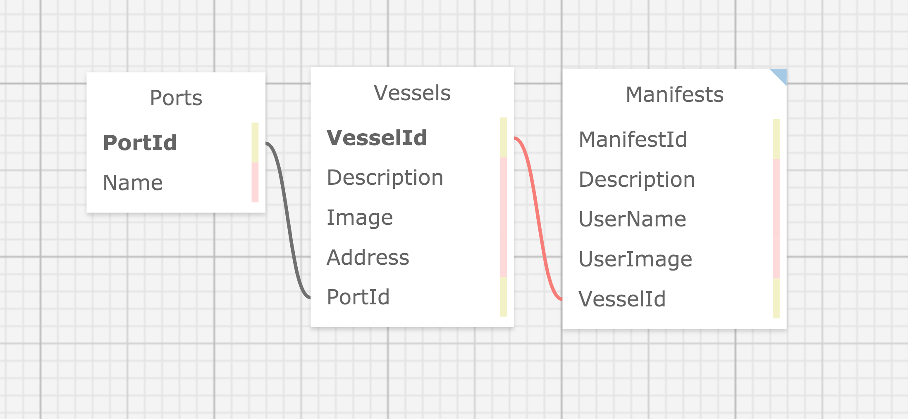

# _Space-Port_

#### _C# ASP.NET MCV Entity Project for Epicodus, October 9, 2020_

#### By _**Grant Eadie**_

## Description

This application is designed for the Ship Manifest Port Director and due oversight by those in higher ranking order. This is a simple directory of currently moared ships, their cargo, and passengers. The database is provided by mySQL.

## Setup/Installation Requirements

- Download option

  - Download files from GitHub repository by click Code and Download Zip
  - Extract files into a single directory
  - Run GitBASH in directory
  - Type "dotnet restore" to get bin and obj files
  - Type "dotnet run" in GitBash to run the program

- Cloning options
  - For cloning please use the following GitHub [tutorial](https://docs.github.com/en/enterprise/2.16/user/github/creating-cloning-and-archiving-repositories/cloning-a-repository)
  - Place files into a single directory
  - Run GitBASH in directory
  - Type "dotnet restore" to get bin and obj files
  - Type "dotnet run" in GitBash to run the program

## Database Routing

## Known Bugs

Search bar in the upper right corner does not function. "Systems" and "Crew" dropdown menus will lead to nowhere. 

## Technologies Used

Main Programs

- SQL
- C# / ASP.NET
- MCV
- Entity
- HTML
- CSS
- Javascript

### Other Links

- [GitHub for Grant](https://github.com/granteadie)

### License

Copyright (c) 2020 **_{Grant Eadie}_**
Licensed under MIT
